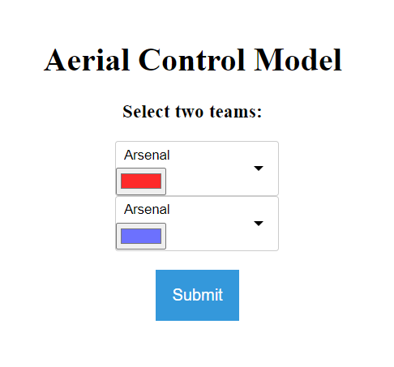
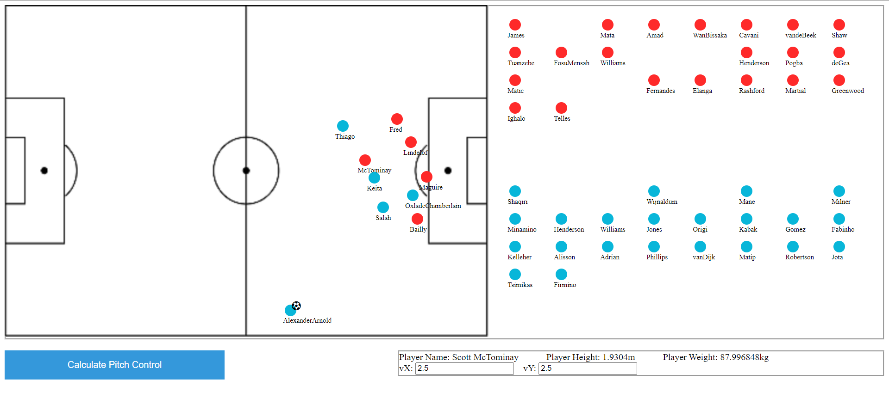

# Aerial-Control Model ⚽

<link rel="icon" type="image/x-icon" href="https://cdn-icons-png.flaticon.com/512/26/26924.png">

## [Click to access the tool](https://razor3598.github.io/Aerial-Control/main.html)

Select two teams from the drop-down box. For now, the teams are Premier League teams of the 2020-2021 season.

1. Drag and drop players and the ball to create the scenario.
2. Set player velocities and ball launch angle.
3. Click on the "Calculate Pitch Control" button.
4. Select end co-ordinates on the pitch.

## Credits
1. Matt Hilton - Formulating the Aerial Control model
2. [Aditya Zingade](https://github.com/ZingAditya24) - Javascript 
3. [Rohan Tergaonkar](https://www.linkedin.com/in/rohan-tergaonkar-481b17188/), [Omkar Kollurmath](https://www.linkedin.com/in/omkar-kollurmath-204616184/?originalSubdomain=in), [Rudra Patel](https://github.com/ruddy2204) - Testing

## Connect with me!

